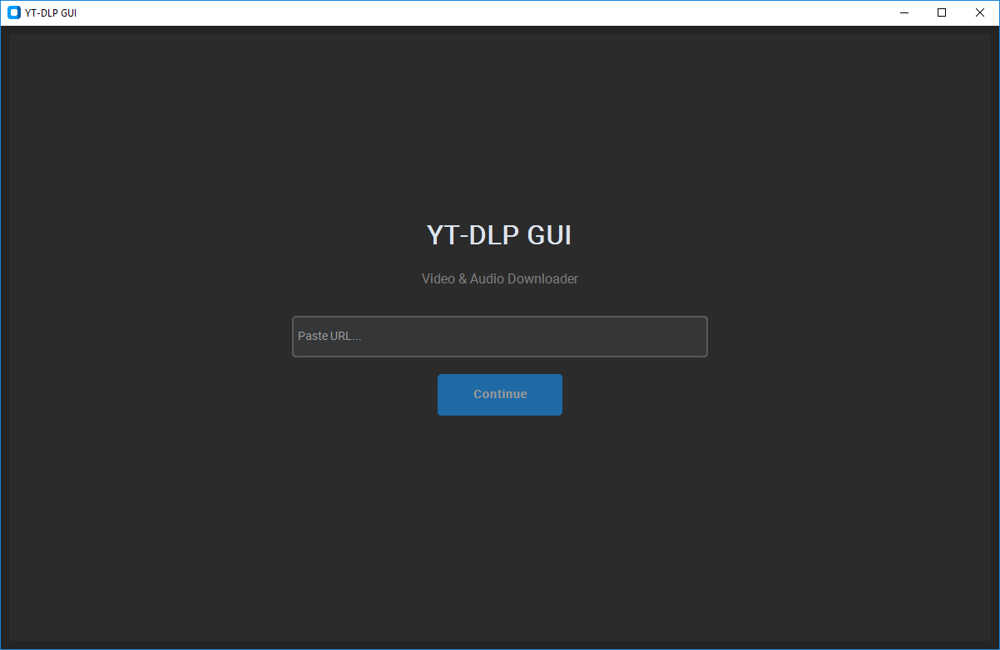
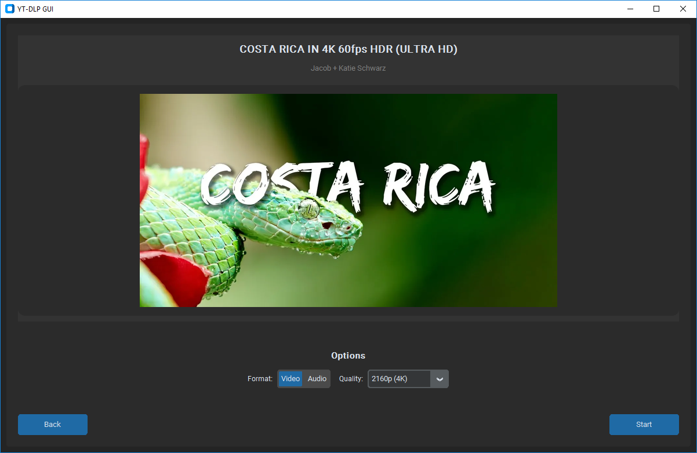
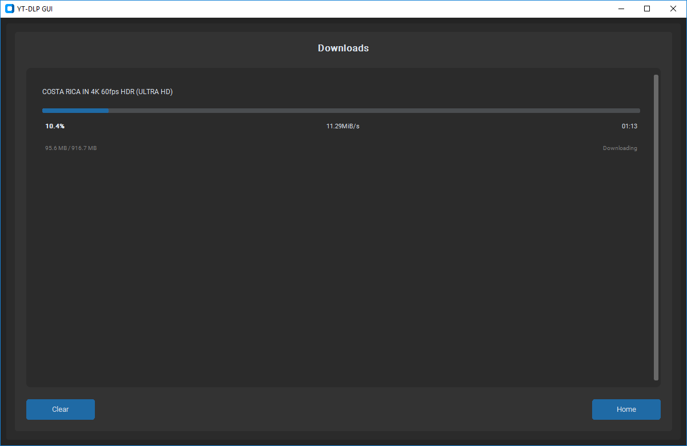

# YT-DLP GUI

## Description

Simple GUI for downloading videos and audio from YouTube and VK using yt-dlp.

Features:
- Video downloads from 144p to 4K quality
- Audio extraction to MP3 format





## Tech Stack

- **Python 3.9+** - Core language
- **CustomTkinter** - Modern GUI framework
- **yt-dlp** - Video downloading engine
- **Pillow** - Image processing
- **PyInstaller** - Executable builds

Supported platforms: Windows, macOS, Linux

## Installation Instructions

### Pre-built executable

1. Download latest release from [Releases](../../releases)
2. Run `yt-dlp-gui.exe`

### From source

```bash
git clone https://github.com/vokrob/yt-dlp-gui.git
cd yt-dlp-gui
pip install -r requirements.txt
python main.py
```

### Build executable

```bash
pip install pyinstaller
python build.py
```

## Usage Instructions

1. Launch the application
2. Paste video URL in the input field
3. Wait for video preview to load
4. Select desired quality and format
5. Click "Start" to begin download

The interface has three main screens:
- **URL Input** - Enter video link
- **Preview** - Video info and download options
- **Progress** - Download status and queue

